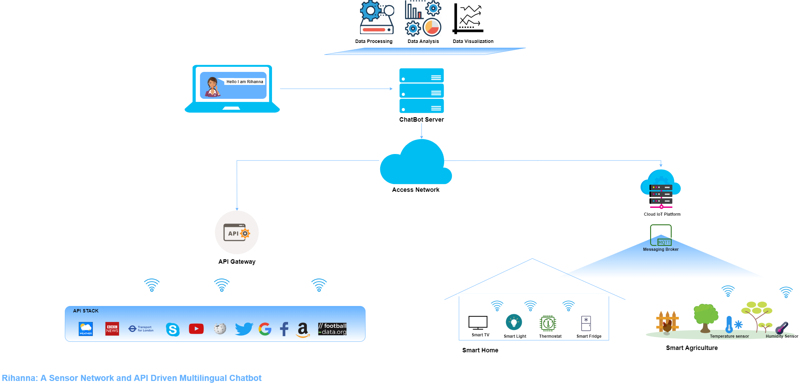

# A ChatBot Named Rihanna
A ChatBot to automate the boring general tasks using conversation and interaction.

Features Includes:
* TFL : Plan Journey and Get live arrivals for Buses, Trains, DLR and Tubes
* Twitter : Posts Tweets, view trending Topics, search twitter, view sentiment analysis on a query and more ..
* Facebook : Posts, view Posts and view friends
* IoT/ Sensor Network interaction: controls and reads data from sensor networks and displays graph upon request
* Word Cloud : Creates word cloud on a given Subject/Topic
* Maths : Solves Maths given maths problems
* Wikipedia : Interacts with wikipedia API to obtain detailed explanations of Topics
* Youtube : Search, display and make playlist of videos from Youtube
* Soundcloud : Search, display and make playlist of songs from soundcloud
* Dictionary : View definitions, synonyms and antonyms of words
* Amazon : Search for products on Amazon and sort by Prices and Reviews
* Job search : Search for Jobs and get a graphical display on the average salary of job in popular cities
* Weather Forecast : Display weather forecast for a given region
* Football : View match and player stats
* Skype : initiate chat and view conversations
* News : View Top global news
* Email : send emails to specified receipts
* Health query: View symptoms, prevention, treatments, causes and self care advice of a condition (NHS API). can also view health news and medicine information
* Docker : automates image pulling, running, starting, stopping and deleting containers upon request
* Games : search and play web games on the interface
* Movies : search and match movies
* Song Lyrics : view requested song lyrics
* Maps : View Map for a given request
* Spotify : play songs
* Image search : search Images
* Word file : create, edit and delete word files
* Covid : displays covid stats on all countries or on a requested country

## This Project was displayed in City Futurescapes event 2020

## Usecase Diagram

